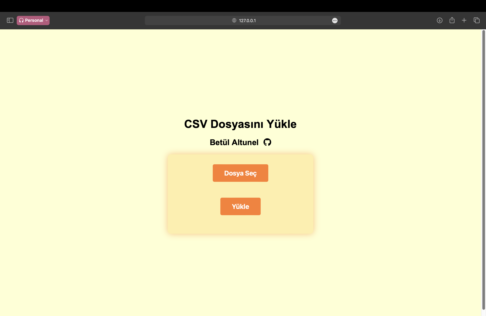
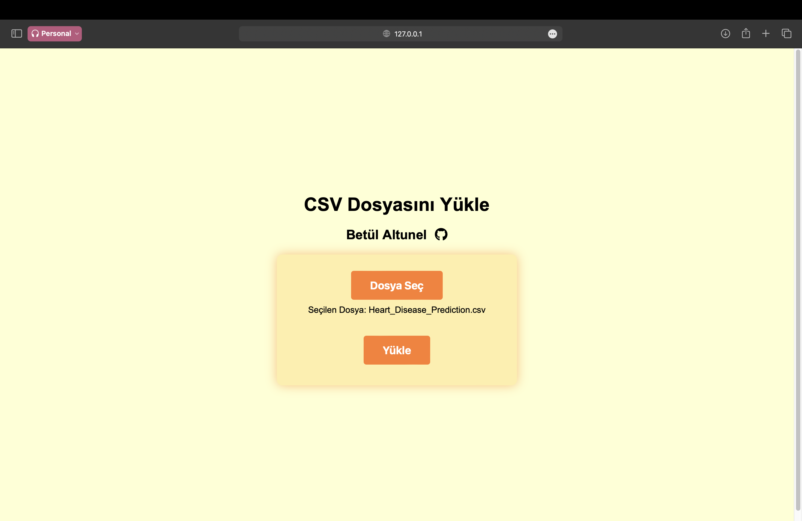
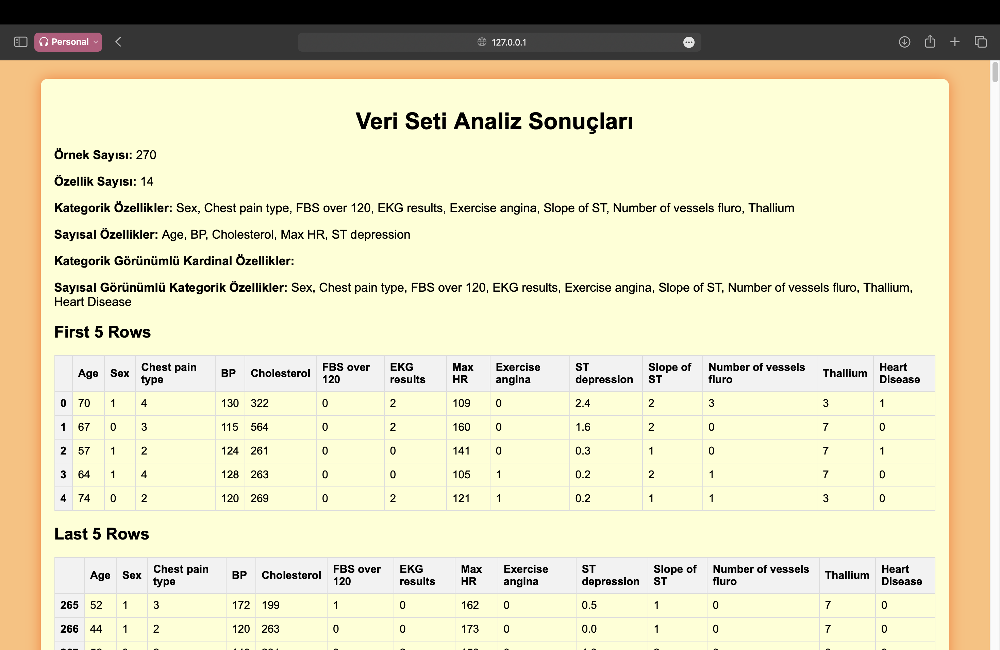

# MI-POWER Empowerment Programı Final Case: Kalp Hastalığı Veri Analizi Flask Uygulaması 

Bu uygulamada, Kalp Hastalığı Tahmini veri seti kullanılarak yapılan
bir veri analizi projesini ele almaktadır.
Amaç, klinik değişkenlerle bireylerin kalp hastalığı riskini tahmin
etmektir.

## Uygulanan Veri Analiz Yöntemleri

1-Kategorik ve Sayısal Değişkenlerin Belirlenmesi

2-Eksik Değerlerin (Missing Values) Analizi

3-Kategorik Değişken Analizi

4-Sayısal Değişken Analizi

5-Hedef Değişken Analizi (Kategorik&Sayısal)

6-Aykırı Değerlerin Analizi ve IQR Yöntemi ile Tespiti

7-Aykırı Değerler için Min-Max ölçeklendirmesi

8-Encoding (Label Encoding)

9-Korelasyon Analizi

10-Feature Scaling

11-Random Forest Classifier

12-Confusion Matrix

13-Sınıflandırma Parametreleri

## Kurulum

1. Depoyu klonlayın:
     
* git clone https://github.com/betulaltunl/MI-POWER_Final_Case.git
 

2. Proje dizinine gidin:
   
* cd heart-disease-flask-app

3. Sanal ortamı etkinleştirin:
   
    Windows için :

    * .\env\Scripts\activate
   
    macOS ve Linux için:
  
    * source env/bin/activate
  
   
4. Install the required dependencies:
   
* pip install -r requirements.txt

## Kullanım

1- Kalp hastalığı veri setini aşağıdaki linkden indirip bir CSV dosyası olarak kaydedin:

[Heart Disease Veri Seti](https://www.kaggle.com/datasets/thedevastator/predicting-heart-disease-risk-using-clinical-var)

2- Flask uygulamasını çalıştırın:

* flask run

3- Web tarayıcınızda görüntüleyin 

4- Sağlanan formu kullanarak CSV veri dosyanızı yükleyin.

## Proje Yapısı

- app.py: Ana Flask uygulama dosyası.

- templates/: HTML şablonlarını içeren dizin.

- index.html: Kullanıcıların veri setini yüklediği ana sayfa.

- result.html: Analiz sonuçlarının görüntülendiği sayfa.

- requirements.txt: Proje için gerekli Python paketlerinin listesi.

- README.md: Bu readme dosyası.

## Proje Ekran Görüntüleri

